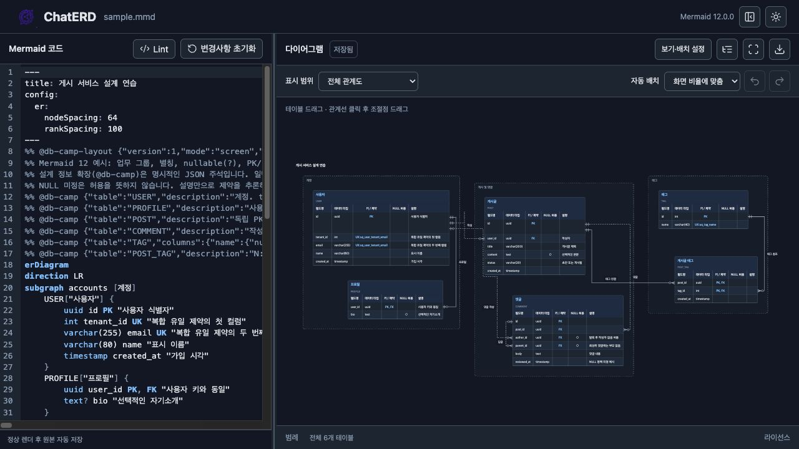
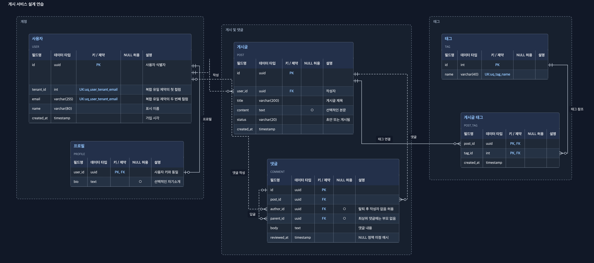

<p align="center"></p>

# ChatERD

AI와 함께 Mermaid ERD를 설계하고 수정하는 스킬과 로컬 뷰어입니다.

## 실제 화면

[샘플 편집 화면 · 원본 보기](docs/images/sample-editor.jpg)

[](docs/images/sample-editor.jpg)

[PNG 원본 · 4596×2044](docs/images/sample-export.png) · [SVG 다운로드](docs/images/sample-export.svg)

[](docs/images/sample-export.png)

## 시작하기

[Node.js](https://nodejs.org/) 22.12 이상을 설치한 뒤 실행하세요.

```sh
git clone https://github.com/Yumetri/ChatERD.git
cd ChatERD
npm run setup
node runtime/cli.mjs preview examples/sample.mmd
```

내 파일을 열려면 마지막 명령의 경로를 바꾸세요.

```sh
node runtime/cli.mjs preview erds/my-schema.mmd
```

## 주요 기능

- 코드 편집과 자동 저장, 외부 파일 변경 시 자동 새로고침
- 테이블과 관계선 이동, 자동 배치, 실행 취소·다시 실행
- 테이블·제약 정보와 그룹별 보기
- 다크·라이트 테마, PNG·SVG 다운로드

[추가 설계 정보 작성법](references/schema-metadata.md)

## 스킬 사용

- [`db-draw`](skills/db-draw/SKILL.md): 요청한 테이블·컬럼·관계를 수정하고 다이어그램에 반영합니다.
- [`db-discuss`](skills/db-discuss/SKILL.md): 현재 ERD의 관계·키·제약을 검토하고 설계 대안과 트레이드오프를 설명합니다. 파일은 수정하지 않습니다.

스킬 이름과 대상 `.mmd` 파일 경로, 요청을 함께 전달하세요.

## 라이선스

ChatERD는 [MIT 라이선스](LICENSE)로 제공합니다. 제3자 구성요소에는 각 원래 라이선스가 적용됩니다.

- [제3자 고지](THIRD_PARTY_NOTICES.md)
- [라이선스 원문](licenses/)
- [ELK 등 제3자 소스 제공 안내](docs/third-party-sources.md)
- [다운로드와 소스 아카이브](https://github.com/Yumetri/ChatERD/releases/tag/v0.1.0)
