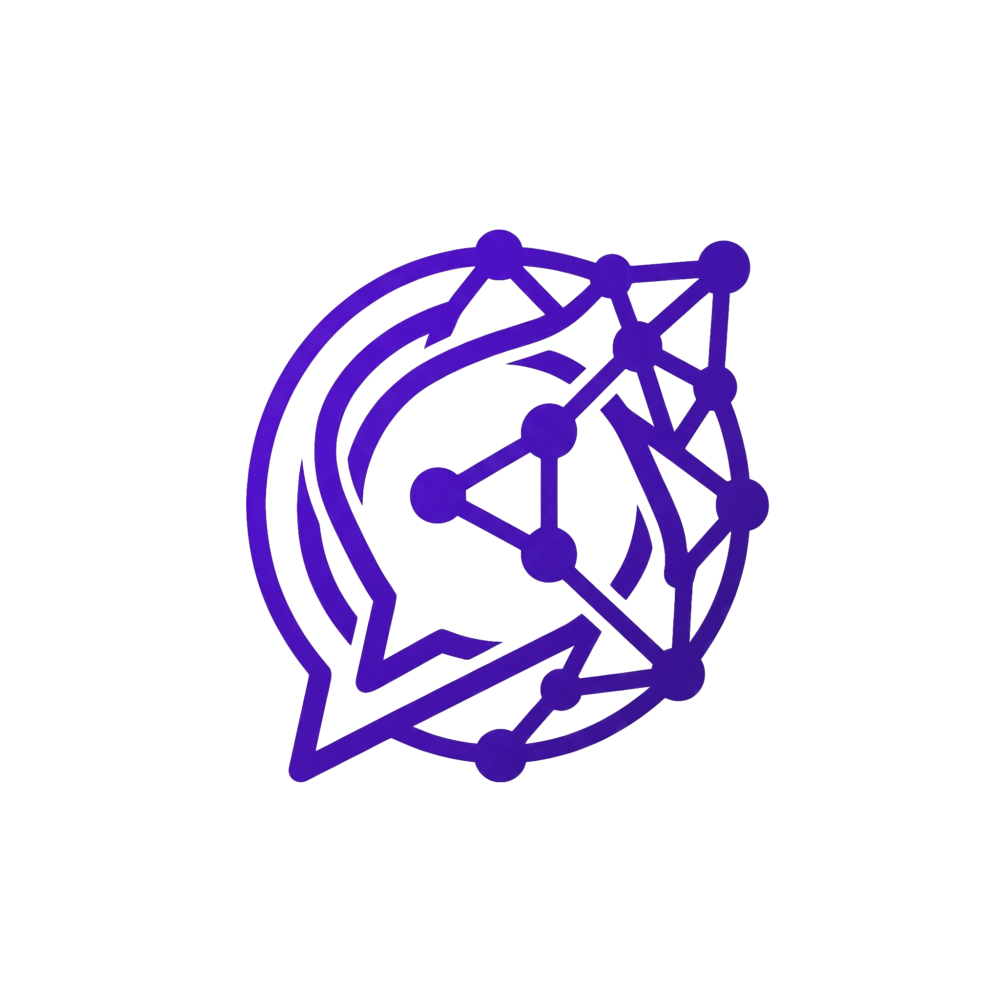

<p align="center"></p>

# ChatERD

A local Mermaid ERD editor with live preview, editable layouts, and optional AI workflows.

사용자가 지정한 기존 UTF-8 Mermaid ERD(`.mmd`)를 직접 편집하거나 채팅으로 수정합니다. 서버·뷰어·SVG 렌더러를 독립 구현했습니다. Node.js ESM, Mermaid **12.0.0** 파서, ELK 배치, CodeMirror를 사용하며 의존성 버전은 잠금 파일에 고정합니다. Go와 Playwright는 사용하지 않습니다.

## 실행

Node.js **22.12 이상**, 채팅 모드에는 Codex CLI가 필요합니다.

```sh
git clone https://github.com/Yumetri/ChatERD.git
cd ChatERD
npm run setup
node runtime/cli.mjs preview examples/sample.mmd
```

본인의 파일은 `examples/sample.mmd` 대신 실제 `.mmd` 경로를 지정합니다. 제공된 `examples/sample.mmd`에는 별칭·업무 그룹·NULL·복합 키·FK·자기 참조·연결 테이블·제약 예시가 있습니다. 스킬은 예시의 이름과 경로를 가정하지 않습니다.

직접 입력은 정상 렌더 후 원본에 자동 저장됩니다. 오류 초안은 에디터에 남고 마지막 정상 파일·그림은 유지합니다. 외부 `.mmd` 저장도 초안·검수 후보와 충돌하지 않으면 자동으로 다시 그립니다. 외부 파일에 오류가 있으면 그 파일은 디스크에 남고 마지막 정상 그림을 유지합니다. 충돌은 덮어쓰지 않으며 상단 **변경사항 초기화**는 초안을 버릴지 확인하고 원본을 다시 읽습니다.

상단 **코드 패널 접기/열기 아이콘**로 소스 패널을 숨기거나 복원합니다. 코드와 다이어그램 사이 경계선을 좌우로 드래그해 너비를 조절하며, 경계선에 포커스를 둔 뒤 방향키로도 조절할 수 있습니다. 두 번 클릭하면 기본 크기로 돌아갑니다. 패널 크기·접힘 상태는 브라우저에 기억하며 `.mmd`에는 기록하지 않습니다. 좁은 화면에서는 위아래로 크기를 조절합니다.

테마는 같은 파일의 뷰어 세션에서 공유합니다. 최초 뷰어만 브라우저의 테마 선호를 적용하며, 이후 탭은 기존 세션의 테마를 따릅니다. 테마를 바꾸면 모든 탭의 화면·SVG·전체 PNG가 함께 갱신됩니다. 외부 파일 수정이나 코드 편집은 현재 테마를 유지합니다. `npm test`에는 실제 앱의 상태 조정 코드와 서버 세션을 연결한 테마 회귀 검사가 포함됩니다.

다운로드 아이콘 메뉴의 PNG/SVG 버튼을 눌렀을 때만 브라우저 기본 다운로드 설정으로 저장합니다. 확대·이동·상세 보기와 관계없이 **전체 그림**을 내보냅니다. LLM 검수와 다운로드는 동일한 전체 SVG·PNG를 사용합니다. 렌더링·변환 중 또는 오류 상태에서는 다운로드를 막습니다. 앱은 이미지를 자동으로 파일에 저장하지 않습니다. 인증된 세션 정보와 로그는 Git에서 제외된 `.runtime`에 보관합니다.

## 채팅과 권한

프로젝트 스킬 `$db-draw`, `$db-discuss`를 명시적으로 호출하고 파일 경로와 요청을 전달합니다. 자동 선택은 꺼져 있습니다. CLI에서는 뷰어를 열어 둔 뒤 다음과 같이 실행합니다.

```sh
node runtime/cli.mjs draw /path/to/your-schema.mmd <<'REQUEST'
이번 수정 요청과 필요한 대화 문맥
REQUEST
node runtime/cli.mjs discuss /path/to/your-schema.mmd <<'REQUEST'
이번 토론 질문과 필요한 대화 문맥
REQUEST
node runtime/cli.mjs stop /path/to/your-schema.mmd
```

격리 Codex는 읽기 전용 파일 샌드박스와 전용 MCP만 사용하며 셸·브라우저·앱·플러그인 도구를 제공하지 않습니다. discuss는 조회 도구 2개만 제공하고 서버도 쓰기 API를 거부합니다. 사용자 UI 편집은 계속 가능합니다. draw는 후보 생성·저장 도구도 제공합니다. 사용자 전체 Codex 설정은 변경하지 않습니다.

최초 1회는 PNG를 조회하고 시각 검수를 통과해야 합니다. 기록은 파일 경로별로 `.runtime`에 보존합니다. 통과 후 정상 수정은 원본을 직접 수정하고 `node runtime/cli.mjs check <파일.mmd>`로 자동 렌더링을 확인하며 독립 LLM·PNG 검수를 반복하지 않습니다. `status <파일.mmd>`는 검수 모드·초안·충돌·진행 중인 후보를 반환합니다. 문법·메타데이터·렌더 오류나 시간 초과가 나면 엄밀 검수 상태로 복귀하며 정상 렌더만으로 해제되지 않습니다. 가독성 문제를 발견하거나 이미지 검수를 요청하면 `draw`로 다시 검수합니다.

엄밀 검수의 LLM 후보는 사용자 에디터를 바꾸지 않고 렌더링합니다. PNG 조회·시각 검수 통과 후 저장하고 사람의 입력·파일 해시·편집 버전이 바뀌면 후보를 무효화합니다. 자동 보정은 합쳐 최대 2회입니다. 시각 보정에서 엔티티·속성·키·관계·카디널리티·라벨·명시적 제약·그룹 소속이 바뀌면 거부합니다. 이미지 조회와 의미 일치는 검사하지만 LLM의 시각 판단 자체를 증명하지는 않습니다. 정상 자동 경로도 렌더 성공과 충돌 검사를 유지하며, 렌더 성공이 시각적 가독성을 보장하지는 않습니다.

## 표현과 테마

**필드명 → 데이터 타입 → 키 / 제약 → NULL 허용 → 설명** 순서로 표시합니다. 원본은 Mermaid의 `타입 필드명` 문법을 유지합니다. 제목·키는 강조하고 행마다 옅은 교차 배경을 사용합니다. PK 영역 구분은 표시 순서만 바꿉니다. NULL 허용이 명시된 컬럼만 **○**로 표시하고, 나머지는 **빈칸**으로 표시합니다. 빈칸은 NOT NULL 제약을 뜻하지 않습니다. 원본의 NULL 제약은 그대로 보존됩니다.

[명시적 설계 정보](references/schema-metadata.md)에 기본값·생성 방식·복합 UNIQUE·FK 컬럼 대응·CHECK·인덱스를 선언할 수 있습니다. 테이블을 클릭하면 제약·참조 대상·검토 힌트를 확인합니다. 검토 힌트는 설계를 자동 수정하지 않습니다.

FK 대응과 관계선이 명확히 일치하면 선의 양끝은 FK 컬럼과 참조 대상 컬럼의 행 중앙에 붙습니다. 실제 줄바꿈과 PK 표시 순서를 반영하며 테이블을 이동해도 해당 행을 따릅니다. 복합 키는 관련 행 중앙들 사이의 중간 높이를 사용합니다. 대응이 없거나 모호한 관계선은 기존 테이블 외곽 연결을 유지합니다. 카디널리티 기호와 스키마 제약은 원본 그대로 사용합니다.

`web/theme.mjs`의 공통 색상 토큰을 UI·에디터·SVG·내보내기가 공유합니다. 테마 이벤트에서 UI와 현재 SVG를 즉시 바꾸고 배치·확대·이동을 유지합니다. PNG 변환은 비동기이며 완료 전에는 다운로드를 막습니다. 색상 애니메이션이나 별도 지연 보정은 없습니다. 사용자가 명시한 색상의 대비는 별도 확인합니다.

전체·업무 그룹·선택 테이블과 이웃 보기는 렌더 데이터 사본만 사용합니다. 원본 분할이나 컬럼 숨김은 하지 않습니다. 큰 ERD를 화면에 맞추면 글자가 작아지므로 확대·상세 보기를 사용합니다. 범례에 최소·최대 개수와 식별 관계를 설명합니다.

## 자동·수동 배치

전체 관계도의 **자동 배치** 선택에서 가로 방향·세로 방향·화면 비율에 맞춤을 고릅니다. 화면 모드는 방향 후보와 기존 주제 그룹을 여러 줄로 배치한 후보 중 기록된 화면 비율에서 가장 크게 표시할 수 있는 것을 선택합니다. 비율도 원본에 저장하므로 브라우저·LLM·다운로드의 배치가 같습니다. 창 크기를 바꿨을 때는 화면 맞춤 아이콘으로 확대율을 조정하며 배치 자체는 자동으로 덮어쓰지 않습니다.

드래그 편집을 켜면 **테이블 드래그**, **관계선 클릭 후 가운데 경로 조절점·양끝 연결 지점 드래그**가 가능합니다. 빈 공간은 화면 이동, 휠은 확대입니다. 수동 편집은 전체 관계도에서만 활성화됩니다. 직각 경로·테이블 경계·크로우풋 32px 공간을 유지하며 겹치는 테이블·그릴 공간이 없는 경로는 저장하지 않습니다. 드래그 중에는 다운로드를 막고, 놓은 후 정상 렌더링된 배치만 자동 저장합니다.

컬럼에 연결된 끝점은 높이가 해당 행으로 고정됩니다. 좌우 연결 면과 가운데 경로 조절점은 바꿀 수 있으며 기존 테이블 좌표·경로 조절점은 보존합니다. 끝점의 좌우 방향키는 연결 면을 바꾸고 위아래 방향키는 높이를 바꾸지 않습니다.

위치는 별도 파일 대신 `.mmd`의 `%% @db-camp-layout` 한 줄 JSON 주석에 기록합니다. 표준 Mermaid 파서는 이를 주석으로 무시합니다. 다른 Mermaid 뷰어는 설계를 읽을 수 있지만 ChatERD의 수동 위치까지 재현하지는 않습니다. **수동 위치 초기화**는 수동 좌표·경로를 지우고 현재 모드로 다시 배치합니다. 모드 변경도 수동 위치를 초기화합니다. **변경 실행 취소 / 변경 다시 실행** 아이콘은 코드 편집과 배치 변경을 같은 작업 순서로 되돌리거나 다시 적용합니다. 이력은 현재 탭에만 있으며 새 원본 불러오기·외부 설계 버전 반영·새로고침에서 초기화됩니다. 실행 취소 후 새 편집을 하면 다시 실행 이력이 사라집니다. Esc는 진행 중인 드래그를 취소합니다.

### 키보드 단축키

| 동작 | macOS | Windows |
|---|---|---|
| 코드·배치 변경 실행 취소 | ⌘Z | Ctrl+Z |
| 다시 실행 | ⌘Shift+Z | Ctrl+Shift+Z 또는 Ctrl+Y |
| 코드 복사 / 붙여넣기 / 잘라내기 | ⌘C / ⌘V / ⌘X | Ctrl+C / Ctrl+V / Ctrl+X |
| 코드 전체 선택 / 찾기 | ⌘A / ⌘F | Ctrl+A / Ctrl+F |
| 자동 저장·렌더링 상태 보기 | ⌘S | Ctrl+S |

코드 복사·붙여넣기와 검색은 코드 편집기에 포커스가 있을 때 기본 편집 기능을 사용합니다. 다이어그램이나 배치 컨트롤에 포커스가 있으면 실행 취소·다시 실행은 같은 코드·배치 이력에 적용됩니다. 입력창의 기본 단축키와 한글 조합 입력을 가로채지 않습니다. 정상 렌더 후 자동 저장하므로 저장 단축키는 현재 상태를 보여주며, 오류 초안을 강제 저장하거나 이미지를 다운로드하지 않습니다.

좌표는 설계 의미 비교에서 제외합니다. 테이블 삭제·관계 변경으로 더 이상 대응하지 않는 배치 항목은 무시하고 새 요소는 자동 배치합니다. 자세한 형식은 [메타데이터 문서](references/schema-metadata.md)를 확인하세요.

그룹 영역은 테이블과 크로우풋 사이의 공간까지 포함하도록 좌우·아래 48px, 위 68px의 여백을 둡니다. 수동 배치에서 다른 그룹의 테두리가 기호를 지나는 경우에는 기호 주변 4px 여유까지 해당 테두리 구간만 비웁니다. 그룹 배경·실제 관계선·카디널리티는 유지하며 화면과 PNG/SVG에 같은 처리를 적용합니다.

## 구조와 한계

`runtime/server.mjs`가 세션·권한·경합·원자적 저장을 관리합니다. `web/render.mjs`는 실제 Mermaid 파서에서 모델을 읽어 자체 SVG 표와 ELK 관계선을 만듭니다. 기본 Mermaid SVG 렌더러를 패치하지 않습니다. 공유 렌더 함수·폰트·변환 함수가 검수·뷰어·다운로드에 사용됩니다.

ERD만 지원합니다. 방향·별칭·키·nullable·중첩 그룹·그룹 관계·frontmatter 제목과 ER 간격을 처리합니다. 엔티티 style/classDef는 font-size와 fill/stroke/color를 지원합니다. 모든 Mermaid 테마·look·레이아웃·임의 CSS를 동일하게 재현하지는 않습니다. 그룹별 방향은 전체 배치에서 독립적으로 적용되지 않습니다. 수동 좌표·연결 면·경유점은 대응하는 요소가 있는 한 복원하지만 임의 곡선·교차 제거·다른 뷰어의 같은 배치는 보장하지 않습니다. 시스템 폰트 차이도 있습니다. 20메가픽셀·PNG 8MiB 초과, 30초 내 응답 없음은 저장을 거부합니다.

저장 직전 버전·해시·경로 재확인은 일반적인 동시 편집을 보호합니다. 최종 검사와 파일 교체 사이를 공격하는 외부 프로세스에 대한 OS 차원의 완전 격리는 제공하지 않습니다.

## 검증

```sh
npm test
npm run test:render
npm run test:drag
npm audit
```

렌더 테스트는 실제 기본 브라우저와 임시 스키마를 사용하므로 브라우저를 열어 두어야 합니다. 테스트 PNG는 명시적인 검수 산출물로 임시 폴더에만 기록합니다. [검증 기록](docs/verification.md)과 [배치 피드백 기준](references/layout-feedback.md)을 확인하세요.

`test:drag`가 출력한 로컬 주소를 브라우저에서 열면 다수 컬럼·다수 테이블의 반복 이동과 64개 장애물 경로 탐색을 측정합니다. 워밍업 후 처리 시간·경로 계산·그리기·프레임 간격의 중앙값/p95/최댓값을 임시 JSON으로 기록하고, 부분 갱신과 전체 SVG/PNG의 일치도 검사합니다. 완료 후 Ctrl+C로 측정 서버를 종료합니다. 수정 전 `render-before.mjs`·`routing-before.mjs` 복사본이 있는 폴더는 `npm run test:drag -- --baseline /절대/복사본/폴더`로 같은 입력을 비교할 수 있습니다. 기본 실행은 현재 코드만 측정하며 과거 결과를 재현한 것으로 표시하지 않습니다. 측정 결과는 현재 환경에서 생성한 임시 JSON으로 확인합니다. 이는 처리 함수와 DOM 배치 계산의 비용이며 운영체제 입력부터 GPU 표시까지의 지연 측정은 아닙니다.

## 도구 버튼

코드의 **Lint·변경사항 초기화**는 코드 패널 상단에 있습니다. 다이어그램 상단에는 **표시 범위·자동 배치·배치 되돌리기**를 두고, **기본 키(PK) 먼저 표시·드래그 편집·수동 위치 초기화**는 **보기·배치 설정**에서 변경합니다. 좁은 패널에서는 설정 버튼을 짧게 표시하며 설명과 접근성 이름을 유지합니다.

저장 상태를 누르면 렌더링 오류를 포함한 상세 메시지를 읽을 수 있습니다. 하단 **범례**는 관계 읽는 법을 펼치고, **검토 힌트**는 설계 정보 패널을 엽니다. 메뉴는 하나씩 열리며 바깥 클릭·Esc로 닫습니다. 메뉴를 펼쳐도 그림 영역의 높이는 바뀌지 않습니다.

테마 전환은 해·달, 코드 패널은 펼치기·접기, 현재 그림의 화면 맞춤은 모서리 확장, 다운로드는 아래 화살표 아이콘입니다. 아이콘 위에 마우스를 올리면 설명이 표시되고, 키보드·화면 읽기 도구에도 기능 이름을 제공합니다. 테마의 아이콘은 누르면 전환할 대상을 나타냅니다.

- **Lint**: 현재는 코드의 들여쓰기와 줄 앞뒤 공백을 정리합니다. 문법 오류는 렌더링에서 확인하며 정상 결과만 저장합니다. 별도의 모델링 규칙 검사기는 아닙니다.
- **변경사항 초기화**: 저장되지 않은 입력을 버리고 마지막 저장본으로 돌아갑니다. 이미 자동 저장된 변경은 유지됩니다. 실행 전 확인합니다.
- **기본 키(PK) 먼저 표시**: 화면에서 PK 컬럼을 먼저 모아 보여 줍니다. 원본 컬럼 순서는 유지합니다.
- **테이블·제약 정보**: 선택한 테이블의 컬럼·키·제약·참조 관계를 확인합니다.
- **수동 위치 초기화**: 수동으로 옮긴 위치와 경로를 지우고 선택한 방향으로 자동 배치합니다.

Vim 옵션과 의존성은 제거했습니다. 아이콘은 [Lucide 0.468.0](https://github.com/lucide-icons/lucide/tree/0.468.0)의 SVG를 로컬에 포함하며 외부 CDN 요청을 하지 않습니다. [라이선스](licenses/lucide.txt)를 포함합니다.

## 프로젝트 아이콘

`web/assets/chaterd.png`는 제공받은 원본 PNG입니다. GitHub README의 프로젝트 로고, 브라우저 탭 아이콘, 페이지 상단의 ChatERD 로고에 같은 파일을 사용합니다.

## 라이선스와 소스 제공

ChatERD 자체 코드·문서·샘플·프로젝트 로고는 [MIT](LICENSE)로 제공합니다. 제3자 라이브러리와 Lucide 버튼 아이콘에는 각 원래 라이선스가 적용됩니다.

- [제3자 고지와 전체 npm 목록](THIRD_PARTY_NOTICES.md)
- [ELK·EMF 등 소스 제공 안내](docs/third-party-sources.md)
- [라이선스 및 NOTICE 원문](licenses/)
- [v0.1.0 릴리스와 제3자 소스 아카이브](https://github.com/Yumetri/ChatERD/releases/tag/v0.1.0)

뷰어 하단의 **라이선스**에서도 원문과 소스 안내를 열 수 있습니다. 빌드 결과에 라이선스·고지를 함께 복사합니다. 배포할 때 `dist`의 라이선스 파일과 `.LEGAL.txt`를 제거하지 마세요.

## 개발·배포 검증

```sh
npm ci
npm run build
npm test
npm run audit:licenses
```

CI는 Node.js 22·24에서 같은 검사를 실행합니다. 라이선스 감사는 npm 잠금 파일, 실제 브라우저 번들에 들어간 패키지, 원문 고지 파일의 SHA-256을 비교합니다. 의존성을 바꾸면 `npm run licenses:update`로 npm 원문·목록을 갱신하고 변경된 라이선스를 검토합니다. ELK를 바꿀 때는 Java 입력·소스 버전·릴리스 소스 아카이브도 별도로 갱신해야 합니다. [배포 절차](docs/releasing.md)를 따릅니다.

`npm test`는 서버·MCP·파서·배치·앱 상태 조정을 검사합니다. 실제 브라우저의 렌더링·다운로드 검수는 별도입니다. `npm run test:render`와 `npm run test:drag`는 로컬 브라우저를 열 수 있으므로 CI 기본 검사에 포함하지 않습니다.

서버는 `127.0.0.1`에 연결되는 로컬 도구입니다. 직접 미리보기는 Codex 없이 사용합니다. 선택적인 `draw`·`discuss`는 호환되는 Codex CLI와 사용자의 인증을 사용하며, 요청과 대상 스키마를 모델에 전달합니다. Codex 실행 파일이나 인증정보는 이 저장소에 포함하지 않습니다. npm 배포와 공개 다중 사용자 웹 호스팅은 이 릴리스의 배포 방식에 포함되지 않습니다.
