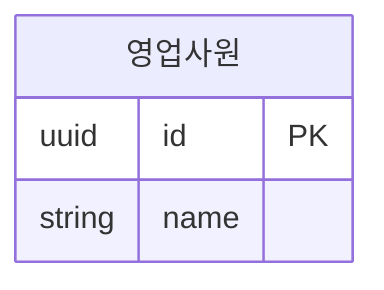

# 명시적 설계 정보

## 이름 표기 규칙

스키마를 작성할 때 테이블명과 필드명은 반드시 영어 식별자로 작성한다. 한글 업무명은 의미에 맞게 영어로 옮기고, 테이블의 한글 설명은 Mermaid의 별칭 문법 `ENGLISH_TABLE["한글 설명"]`으로 표시한다. 필드에는 한글 이름·표시명·주석을 추가하지 않는다. 아래 예시는 영업사원 테이블의 표기 방식이며 기본 스키마가 아니다.



`SALES_REP`가 실제 테이블 식별자이고 `영업사원`은 표시용 별칭이다. 뷰어는 별칭과 영어 테이블명을 함께 표시한다. 관계의 양 끝, `@db-camp`의 `table`·참조 테이블, 배치 메타데이터의 테이블 키에도 영어 식별자를 사용한다. 기존 스키마를 조회할 때는 실제 이름을 그대로 읽으며, 기존 이름을 일괄 변경하는 작업은 사용자 요청 범위에 포함될 때만 수행한다.

## 연관관계 설명 규칙

작성하는 모든 연관관계에는 관계 의미를 설명하는 한글 라벨을 반드시 적는다. 관계 설명을 생략하거나 영어로 쓰지 않는다. 예: `SALES_REP |o..o{ CAR : "판매"`. 관계의 양 끝은 영어 테이블 식별자로 유지한다. 대응하는 `@db-camp` 외래키 메타데이터가 있으면 `label`도 동일한 한글 설명으로 작성한다. 설명만 수정할 때는 참조 컬럼·NULL 허용 여부·카디널리티를 변경하지 않는다.

## 제약 메타데이터

정확한 제약을 보존하기 위해 일반 Mermaid 주석에 `%% @db-camp` 뒤 **한 줄 JSON**을 둔다. 이 확장은 ChatERD의 형식이며 Mermaid 표준의 의미를 바꾸지 않는다. 각 table은 한 번만 선언한다. 사용자가 제공하지 않은 정보를 추정해 추가하지 않는다.

```mermaid
%% @db-camp {"table":"DETAIL","columns":{"record_id":{"nullable":false},"created_at":{"default":"CURRENT_TIMESTAMP"}},"foreignKeys":[{"name":"fk_record","columns":["record_id"],"references":{"table":"RECORD","columns":["id"]},"label":"포함","onDelete":"CASCADE"}]}
erDiagram
    RECORD {
        int id PK
    }
    DETAIL {
        int id PK
        int record_id FK
        timestamp created_at
        text? note
    }
    RECORD ||..o{ DETAIL : 포함
```

예시 이름은 설명용이며 런타임·스킬의 기본값이 아니다.

| 속성 | 의미 |
|---|---|
| table | 실제 엔티티 이름, 별칭이 아님 |
| description | 테이블 설명 문자열 |
| columns | 컬럼 이름별 nullable(boolean), default·generated·description(문자열) |
| unique | `{name,columns:[순서대로 컬럼]}` 목록. 복합 유일 제약은 그룹 이름으로 표시 |
| foreignKeys | `{name,columns,references:{table,columns},label?,onDelete?,onUpdate?}` 목록. 양쪽 컬럼의 순서와 개수가 대응 |
| checks | CHECK 식 문자열 목록. DB에서 실행·검증하지 않음 |
| indexes | `{name,columns}` 목록. 인덱스와 유일 제약은 서로 다름 |

여러 PK 컬럼은 하나의 복합 기본 키다. FK 컬럼은 원본에서 FK로 표시해야 한다. 같은 대상 사이 여러 FK가 있으면 label로 관계선을 구별한다. `?` 타입과 nullable:false, PK와 nullable:true의 충돌은 렌더링·저장을 거부한다. 알 수 없는 컬럼·참조·중복 제약 이름도 거부한다.

FK NULL 여부와 부모 최소 개수, 식별 관계와 PK 참여, 참조 대상의 명시된 유일성 등이 다르면 검토 힌트를 표시한다. 이는 DBMS별 전체 무결성 검증이나 설계 정답 판정이 아니다. 없는 정보를 자동으로 추가하지 않는다. 1:N 관계 자체를 업무 위계로 해석하지 않는다.

## 외래키 그룹 표시

하나의 외래키 제약은 하나의 `foreignKeys` 항목으로 기록한다. 복합 외래키는 `columns`와 `references.columns`에 참여 컬럼 전체를 대응 순서대로 적는다. 여러 단일 외래키로 나눠 표현하지 않는다. 같은 컬럼은 서로 다른 외래키 항목에 참여할 수 있다. 메타데이터가 없는 FK의 참조 컬럼이나 묶음은 추정하지 않는다.

뷰어는 각 테이블의 `foreignKeys` 배열 순서로 `FK1`, `FK2`, … 번호를 부여한다. 같은 번호가 붙은 컬럼들은 하나의 외래키에 함께 참여한다. 여러 외래키에 참여하는 컬럼에는 모든 번호를 표시한다. 관계선에는 대응하는 자식 테이블의 번호를 표시하고, 복합 외래키에는 `복합`을 덧붙인다. 매핑이 모호한 관계선에는 번호를 추정하지 않는다. 번호는 DB 제약 이름이 아닌 테이블별 표시 규칙이며, 다른 테이블의 같은 번호와는 별개다.

테이블 하단의 **복합 외래키 컬럼 묶음**에는 컬럼이 둘 이상인 외래키만 표시한다. 예를 들어 FK1과 FK3이 복합이고 FK2가 단일이면 다음과 같이 표시한다. 단일 항목을 숨긴 뒤 번호를 다시 매기지 않는다.

```text
FK1 · 복합 (record_id, team_id)
FK3 · 복합 (membership_id, player_id, team_id)
```

단일 외래키는 컬럼·관계선·상세 정보에서 확인하며 하단에 반복하지 않는다. 복합 외래키가 없는 테이블에는 하단 영역을 만들지 않는다. 이 표시는 뷰어와 SVG·PNG 출력에 동일하게 적용한다. 원본의 키는 Mermaid가 지원하는 `FK`로 유지하고, 관계 라벨과 메타데이터 `label`에는 한글 관계 의미만 적는다. 표시를 위해 `FK1`을 키로 쓰거나 `[FK1 · 복합]`을 원본 라벨에 삽입하지 않는다. 기존 FK 배열 순서는 표시 번호가 유지되도록 사용자 요청 없이 바꾸지 않는다.

## 뷰어 배치 주석

`%% @db-camp-layout` 뒤 한 줄 JSON은 **그림 배치만** 지정한다. Mermaid 파서는 이 줄을 일반 주석으로 무시한다. YAML frontmatter가 있으면 그 뒤에 놓는다. 한 파일에 한 번만 선언한다.

```text
%% @db-camp-layout {"version":1,"mode":"screen","aspect":1.4,"nodes":{"ENTITY":{"x":64,"y":300}},"edges":{}}
```

`ENTITY`는 설명용 자리표시자다. 항상 사용자가 지정한 파일의 실제 테이블 이름을 쓴다. 별도 스키마 이름·경로를 가정하지 않는다.

| 속성 | 의미 |
|---|---|
| version | 현재 형식은 1 |
| mode | horizontal(가로), vertical(세로), screen(화면) |
| aspect | 화면 모드의 기준 가로/세로 비율. 0.1~10, 생략하면 1.5 |
| nodes | 테이블 실제 이름 → `{x,y}`. 전체 그림의 절대 좌표 |
| edges | 안정적인 관계 식별 문자열 → `{via?,from?,to?}` |
| via | 경로가 통과할 `{x,y}` 조절점 |
| from, to | `{side,ratio}`. side는 N/E/S/W, ratio는 해당 면의 위치 0.05~0.95 |

관계 식별 문자열은 `[출발 이름,도착 이름,라벨,출발 카디널리티,도착 카디널리티,식별 여부,같은 관계의 중복 순번]` 배열을 JSON 문자열로 만든 키다. 뷰어가 생성한다. 관계 선언 순서를 바꾸거나 다른 관계를 추가해도 의미가 같은 관계의 배치는 유지된다. 의미가 바뀐 관계와 삭제된 테이블의 이전 좌표는 무시한다. 좌표는 0~100000의 유한 수만 허용한다. 잘못된 JSON·형식은 정상 렌더와 원본 저장을 거부한다.

배치 주석은 엔티티·속성·키·관계·카디널리티·라벨·제약의 의미 비교에서 제외한다. 기존 수동 위치는 사용자 요청 없이 초기화하지 않는다. draw의 시각 보정에서는 사용자 지시 범위의 배치 조정만 허용하고 실제 이미지·설계 의미 보존을 확인한다. discuss는 배치 메타데이터도 조회만 한다. 수동 좌표를 넣기 위해 가짜 엔티티·관계를 추가하지 않는다.

뷰어의 모드 선택과 드래그는 이 주석만 변경하며, 정상 렌더 후 저장하는 기존 경합·원자적 저장 흐름을 그대로 사용한다. 자동 배치 복원은 nodes/edges를 비운다. 주석을 제거하면 원본의 direction·간격에 따른 자동 배치로 돌아간다. 다른 Mermaid 뷰어는 이 확장을 적용하지 않는다.
